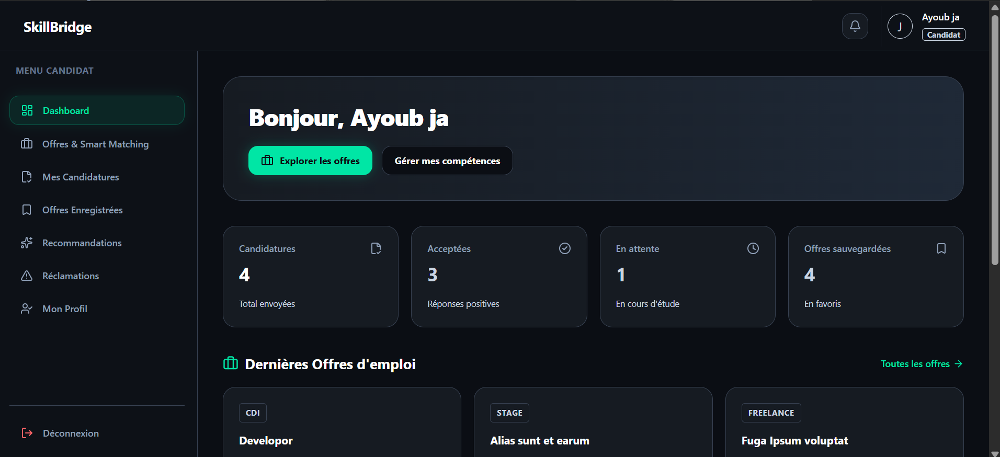
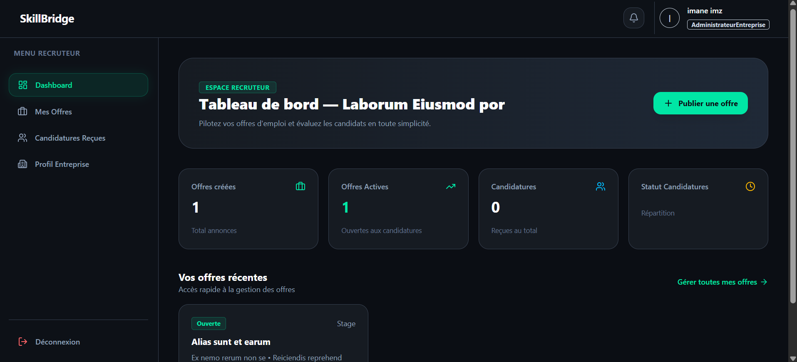

# 1. Nom du projet

**Nom du projet :** SkillBridge – Plateforme intelligente de recrutement et de gestion des candidatures

---

# 2. Présentation du projet

SkillBridge est une plateforme web Full Stack basée sur l'architecture MERN qui facilite la mise en relation entre les candidats et les entreprises.
Elle permet aux candidats de rechercher des offres d'emploi ou de stage, de gérer leur profil et de suivre leurs candidatures.
Les entreprises peuvent publier des offres, consulter les candidatures reçues et gérer leur recrutement.
L'administrateur assure la gestion globale de la plateforme et le traitement des réclamations.

---

# 3. Problématique

Le problème identifié est que les candidats peuvent avoir des difficultés à trouver des offres adaptées à leurs compétences et à suivre facilement leurs candidatures. Les entreprises peuvent également rencontrer des difficultés pour gérer les offres et organiser les candidatures reçues.

La solution proposée permet de centraliser la recherche d'offres, la gestion des profils, la publication des offres et le suivi des candidatures dans une seule plateforme. Un système de compatibilité basé sur les compétences permet également d'aider à identifier les profils correspondant aux offres.

---

# 4. Fonctionnalités principales

* Créer et gérer un profil candidat ou entreprise
* Rechercher et filtrer les offres d'emploi et de stage
* Publier et gérer des offres de recrutement
* Déposer et suivre des candidatures
* Sauvegarder des offres pour les consulter ultérieurement
* Gérer les utilisateurs, les entreprises et les réclamations

---

# 5. Technologies utilisées

| Technologie       | Utilisation dans le projet                              |
| ----------------- | ------------------------------------------------------- |
| React.js          | Développement de l'interface utilisateur                |
| Redux Toolkit     | Gestion de l'état global de l'application               |
| Tailwind CSS      | Création et personnalisation de l'interface utilisateur |
| Axios             | Communication entre le frontend et l'API                |
| Node.js           | Exécution du backend JavaScript                         |
| Express.js        | Création du serveur et des API REST                     |
| MongoDB           | Stockage des données de l'application                   |
| Mongoose          | Modélisation et gestion des données MongoDB             |
| JWT               | Authentification et gestion des sessions                |
| bcryptjs          | Hachage sécurisé des mots de passe                      |
| express-validator | Validation des données envoyées par les utilisateurs    |
| Docker            | Conteneurisation de l'application                       |
| Git & GitHub      | Gestion et versionnement du projet                      |
| Postman           | Test et documentation des API                           |

---

# 6. Installation et lancement

## 6.1 Prérequis

Pour utiliser ce projet, vous devez disposer de :

* Node.js version 18 ou supérieure
* npm
* MongoDB local ou un compte MongoDB Atlas
* Git
* Un éditeur de code comme Visual Studio Code

---

## 6.2 Cloner le dépôt

```bash
git clone https://github.com/votre-utilisateur/skillbridge.git
```

---

## 6.3 Ouvrir le dossier

```bash
cd skillbridge
```

---

## 6.4 Installer les dépendances

Installer les dépendances du backend :

```bash
cd server
npm install
```

Installer ensuite les dépendances du frontend :

```bash
cd ../client
npm install
```

---

## 6.5 Variables d'environnement

Créer un fichier `.env` dans le dossier `server/`.

Les principales variables utilisées sont :

```env
PORT=5000
MONGO_URL=votre_url_mongodb
ACCESS_TOKEN_SECRET=votre_secret_jwt
```

La valeur de `MONGO_URL` doit contenir l'URL de connexion à votre base de données MongoDB.

La valeur de `ACCESS_TOKEN_SECRET` doit être une clé secrète personnelle utilisée pour signer les tokens JWT.

> Les valeurs réelles du fichier `.env` ne doivent jamais être publiées sur GitHub.

---

## 6.6 Lancer le projet

### Backend

Dans le dossier `server/` :

```bash
npm run dev
```

Le serveur backend fonctionne sur :

```text
http://localhost:5000
```

### Frontend

Dans un deuxième terminal, ouvrir le dossier `client/` :

```bash
npm run dev
```

Le frontend fonctionne généralement sur :

```text
http://localhost:5174
```

---

## 6.7 Ouvrir le projet

Après le lancement du frontend, ouvrir :

```text
http://localhost:5174
```

L'API backend est disponible sur :

```text
http://localhost:5000/api
```

### Point de vigilance

* Vérifier que MongoDB est accessible.
* Vérifier que les variables du fichier `.env` sont correctement configurées.
* Lancer le backend et le frontend dans deux terminaux différents.
* Vérifier les chemins des dossiers `server` et `client`.
* Ne jamais publier les mots de passe, clés JWT, tokens ou identifiants MongoDB.

---

# 7. Captures d'écran

## Capture 1

### Titre

```text
Tableau de bord du candidat
```

### Image





### Explication

Cette capture montre l'espace candidat de SkillBridge permettant au candidat d'accéder à son tableau de bord et de gérer ses différentes fonctionnalités.

---

## Capture 2

### Titre

```text
Gestion des offres d'emploi
```

### Image

```md

```

### Explication

Cette capture montre le tableau de bord de l'entreprise. Il permet au recruteur de consulter les principales informations liées à son activité sur la plateforme, notamment les offres publiées, les candidatures reçues et les différentes actions de gestion disponibles.

---

# 8. Contribution personnelle

Ma contribution principale a porté sur le développement Full Stack de la plateforme SkillBridge avec l'utilisation de React.js, Redux Toolkit, Node.js, Express.js et MongoDB.

J'ai également travaillé sur l'authentification des utilisateurs, la gestion des rôles, les interfaces candidat, entreprise et administrateur, ainsi que sur la gestion des offres, des candidatures, des notifications et des réclamations.

J'ai été responsable de plusieurs parties du frontend et du backend, ainsi que de la conception et de la documentation des diagrammes UML, notamment le diagramme de cas d'utilisation, le diagramme de classes et le diagramme de séquence.

---

# 9. Difficultés rencontrées

## Difficulté 1

### Problème rencontré

Une difficulté rencontrée concernait la connexion entre le backend Node.js et la base de données MongoDB. La variable d'environnement contenant l'URL de connexion n'était pas correctement récupérée par l'application.

### Recherches / Tests

J'ai vérifié la configuration du fichier `.env`, le chargement des variables avec `dotenv` ainsi que la configuration de la connexion Mongoose.

### Solution

J'ai corrigé la configuration des variables d'environnement et vérifié que l'URL MongoDB était correctement chargée avant d'établir la connexion avec la base de données.

### Ce que j'ai appris

Cette difficulté m'a permis de mieux comprendre la gestion des variables d'environnement avec Node.js, `dotenv` et la connexion à MongoDB avec Mongoose.

### Texte final

J'ai rencontré le problème suivant : la variable contenant l'URL de connexion MongoDB n'était pas correctement récupérée par le backend.

Pour comprendre l'origine du problème, j'ai vérifié le fichier `.env`, la configuration de `dotenv` et le code de connexion Mongoose.

J'ai résolu le problème en corrigeant la configuration des variables d'environnement et en vérifiant leur chargement avant la connexion à MongoDB.

Cette difficulté m'a permis d'apprendre à mieux gérer les variables d'environnement et la connexion entre une API Node.js et MongoDB.

---

## Difficulté 2

### Problème rencontré

Une autre difficulté concernait la documentation de l'API avec Swagger. Certaines références vers les modèles Mongoose n'étaient pas correctement reconnues dans la documentation.

### Recherches / Tests

J'ai vérifié les fichiers de configuration Swagger, les références `$ref` utilisées dans les schémas ainsi que la déclaration des modèles dans la documentation OpenAPI.

### Solution

J'ai corrigé les références Swagger afin qu'elles correspondent correctement aux modèles déclarés dans la documentation de l'API.

### Ce que j'ai appris

Cette difficulté m'a permis de mieux comprendre la documentation d'une API REST avec Swagger/OpenAPI et l'utilisation des références entre les différents schémas.

---

# 10. Améliorations possibles

Dans une prochaine version, je pourrais :

* Mettre en place une pipeline GitHub Actions pour automatiser les vérifications et le déploiement.
* Ajouter davantage de tests automatisés pour le frontend et le backend.
* Améliorer la sécurité de l'authentification et de la gestion des fichiers.
* Déployer la plateforme en production avec une infrastructure adaptée.

### Conclusion

Ces améliorations permettraient de rendre SkillBridge plus sécurisé, plus fiable et plus facile à maintenir et à déployer.

---

# Documentation UML

## Architecture & Diagrammes UML

Les diagrammes UML permettent de représenter les principaux acteurs, les relations entre les éléments du système et le déroulement de certaines fonctionnalités.

### 1. Diagramme de Cas d'Utilisation (Use Case Diagram)


Ce diagramme présente les principaux acteurs de SkillBridge et les fonctionnalités auxquelles ils peuvent accéder selon leur rôle.

### 2. Diagramme de Classes (Class Diagram)


Ce diagramme représente les principales classes du système ainsi que leurs attributs et leurs relations.

### 3. Diagramme de Séquence (Sequence Diagram - Inscription / Register)


Ce diagramme présente les différentes étapes de l'inscription d'un utilisateur, depuis l'envoi des informations par le frontend jusqu'au traitement de la demande par le backend et l'enregistrement dans MongoDB.

---

# Checklist finale

## Présentation

* [x] Le nom du projet est clair.
* [x] Le projet est présenté en 3 à 5 lignes.
* [x] Le public cible est identifié.
* [x] Le besoin est expliqué.
* [x] L'objectif est précisé.

## Fonctionnalités

* [x] 3 à 6 fonctionnalités.
* [x] Chaque fonctionnalité commence par un verbe.
* [x] Elles correspondent à des actions réelles.

## Technologies

* [x] Les technologies sont indiquées.
* [x] Leur rôle est expliqué.

## Installation

* [x] Les prérequis sont présents.
* [x] Les commandes d'installation sont indiquées.
* [x] Les variables d'environnement sont présentées.
* [x] L'adresse locale est indiquée.
* [x] Aucune donnée sensible n'est publiée.

## Captures

* [x] Deux captures sont prévues.
* [x] Chaque capture possède un titre.
* [x] Chaque capture possède une explication.
* [x] Les chemins des images sont indiqués.

## Contribution

* [x] Ma contribution est précise.
* [x] Les tâches sont clairement décrites.
* [x] Les différentes parties du projet sont présentées.

## Difficultés

* [x] Les difficultés sont expliquées.
* [x] Les recherches sont décrites.
* [x] Les solutions sont précisées.
* [x] Les apprentissages sont présentés.

## Améliorations

* [x] 4 améliorations sont proposées.
* [x] Elles sont réalistes.

---

# Validation finale

Une personne qui ne connaît pas SkillBridge peut comprendre son objectif, les utilisateurs concernés, les principales fonctionnalités, les technologies utilisées, la contribution réalisée, les difficultés rencontrées ainsi que les étapes nécessaires pour installer et lancer le projet.
